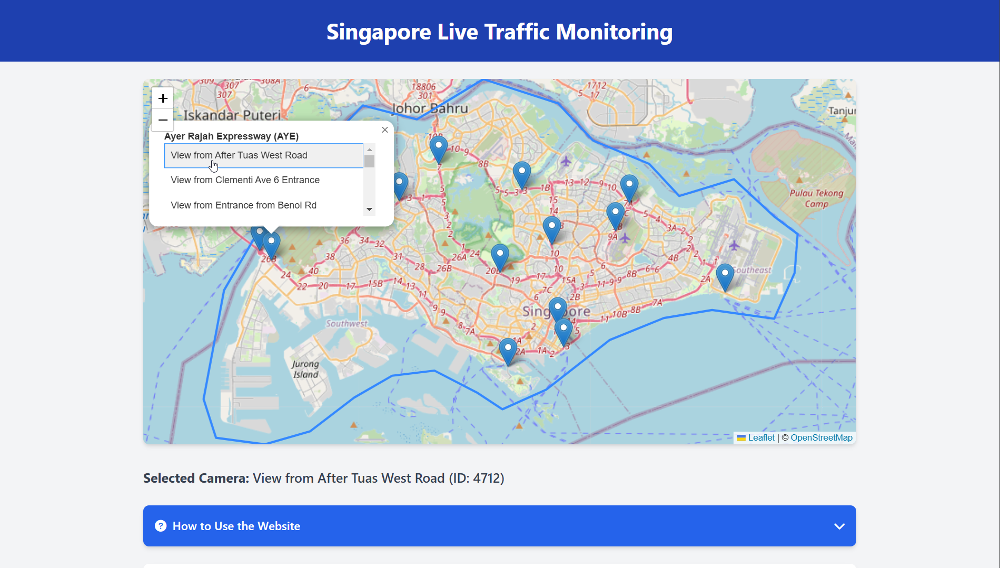
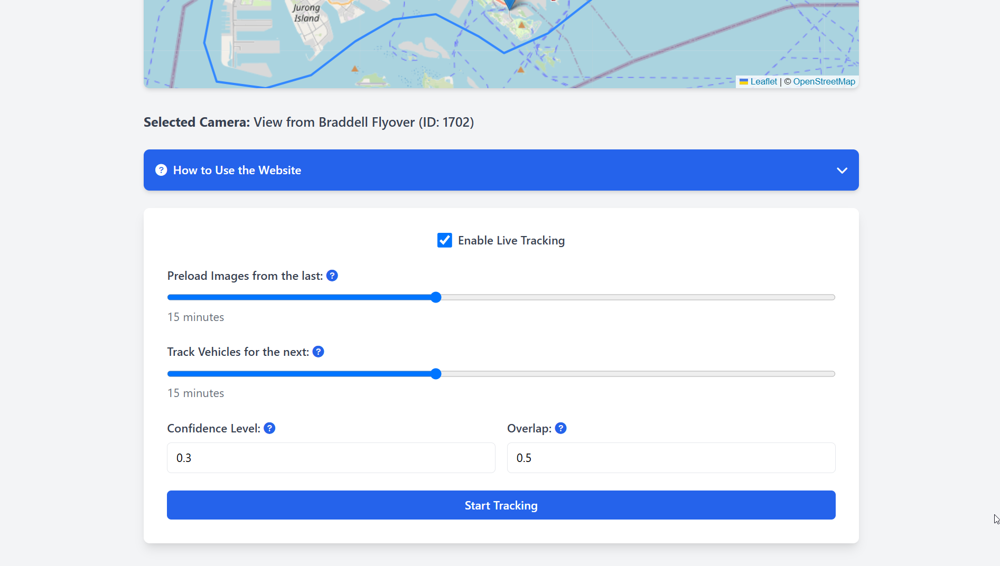
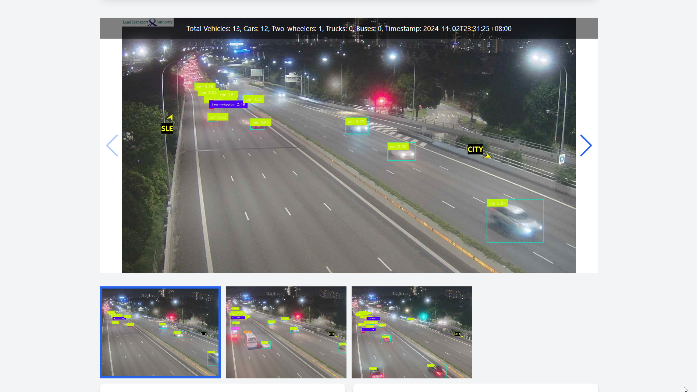
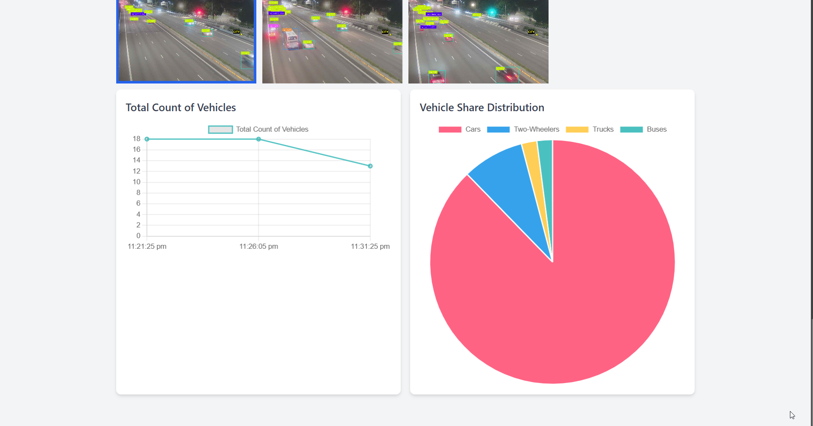

# Singapore Live Traffic Monitoring Using YOLOv11
Realtime website dashboard demostrating the use of YOLOv11 for vehicle detection and classification of Live Traffic Images obtained through the [API](https://data.gov.sg/datasets/d_6cdb6b405b25aaaacbaf7689bcc6fae0/view#tag/default/GET/transport/traffic-images) exposed by the Singapore Government.
The model was trained using Roboflow on a comprehensive [dataset](https://universe.roboflow.com/blazestorm/vms-all/model/4) created by merging multiple annotated image datasets of Singaporean traffic from the Roboflow Universe.
More info on the training process can be found in this [notebook](https://colab.research.google.com/drive/1DUBVueSFdgIARI18qpFz1D-WBL5FGInM?usp=sharing).

## Screenshots





## Getting Started
Obtain [roboflow api](https://inference.roboflow.com/quickstart/configure_api_key/) key and set it up as a Environment Variable in an .env file in project root:
```
ROBOFLOW_API_KEY=your_api_key_here
```
Install the required Node.js packages using the following command:
```
npm install
```
Ensure [vercel](https://vercel.com/guides/using-express-with-vercel) CLI is installed:
```
npm install vercel
```
Login to Vercel:
```
vercel login
```
Running app locally:
```
vercel dev
```
Publish app to vercel:
```
vercel
```